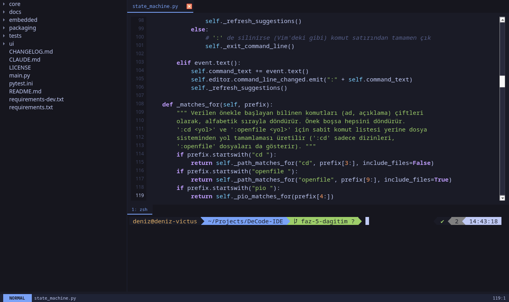

# DeCode IDE

Vim'in modal giriş modelini PyQt6'nın hafifliğiyle birleştiren bir kod
editörü. Uzun vadeli hedefi, gömülü (PlatformIO) geliştirme için gerekenleri —
kod, terminal, derleme, seri monitör — tek pencerede toplamak.

İki değişmez ilke: **her şey klavyeden yönetilebilir** ve **arayüz Tokyo Night
paletine sadık kalır**.



## Kurulum

### Hazır çalıştırılabilir (önerilen)

[Releases](https://github.com/denizbugraerol/DeCode-IDE/releases) sayfasından
sisteminize uygun dosyayı indirin. Python, pip ya da bağımlılık kurulumu
gerekmez.

**Linux (x86_64):**

```bash
chmod +x DeCode-*-linux-x86_64
./DeCode-*-linux-x86_64
```

Gereksinim: glibc 2.35+ (Ubuntu 22.04+, Debian 12+, Fedora, Arch), Wayland ya
da X11 oturumu.

**macOS (Apple Silicon):**

```bash
chmod +x DeCode-*-macos-arm64
xattr -d com.apple.quarantine DeCode-*-macos-arm64
./DeCode-*-macos-arm64
```

Binary imzasız olduğu için macOS onu ilk açılışta karantinaya alır; yukarıdaki
`xattr` satırı bunu kaldırır (alternatif: Finder'da sağ tık → Aç). Kod
imzalama ve notarization bilinçli olarak yapılmıyor — ücretli bir Apple
Developer üyeliği gerektirir ve uygulamanın çalışması için şart değildir.

> macOS derlemesi otomatik testlerden geçiyor (gerçek PTY testleri dahil),
> ancak elle denenmedi: projenin bir Mac'i yok. Geri bildirim memnuniyetle
> karşılanır.

Intel Mac'ler ve Windows için hazır dosya yok. Windows'ta uygulama şu an hiç
çalışmıyor: gömülü terminal `pty`/`fcntl`/`termios` kullanıyor ve bunların
Windows karşılığı (ConPTY) henüz yazılmadı.

### Kaynaktan

```bash
git clone https://github.com/denizbugraerol/DeCode-IDE.git
cd DeCode-IDE
python3 -m venv .venv && .venv/bin/python -m pip install -r requirements.txt
.venv/bin/python main.py
```

### Sorun giderme

Tek dosya çalıştırılabilir, kendini açmak için `/tmp` kullanır (Linux). Sertleştirilmiş
bazı sistemlerde `/tmp` `noexec` bağlıdır ve uygulama açılmaz; o durumda başka
bir dizin gösterin:

```bash
TMPDIR=~/.cache ./DeCode-*-linux-x86_64
```

## Modlar

| Mod | Giriş | Ne yapar |
|---|---|---|
| **NORMAL** | `Esc` | Tuşlar metin yazmaz; komut bekler. İmleç kalın. `Esc` arama vurgusunu temizler |
| **INSERT** | `i` | Normal metin girişi. İmleç ince |
| **COMMAND** | `:` | Ekranın ortasında komut kutusu; komut `Enter` ile çalışır |

**Navigasyon ok tuşlarındadır** — bu, Vim'den bilinçli bir ayrılıştır.
Ok, `Home`/`End`, `PageUp`/`PageDown`; `Shift+Ok` seçer, `Ctrl+Ok` kelime
atlar. `h/j/k/l`, `w/b`, `gg`/`G` uygulanmayacaktır.

## Komutlar

| Komut | Ne yapar |
|---|---|
| `:w` · `:wq` · `:q` · `:qa` · `:wqa` | Kaydet / kaydedip kapat / kapat / hepsinden çık |
| `:42` | 42. satıra git |
| `:d` · `:y` · `:p` | Satırı sil / kopyala / yapıştır |
| `:find <desen>` | Dosya içinde ara; `n` / `N` ile eşleşmeler arasında gez |
| `:replace <eski> <yeni>` | Dosya içinde değiştir (tırnaklı argüman destekli) |
| `:ts` | Bulanık dosya arama paleti (telescope) |
| `:sym` | Açık dosyadaki fonksiyon/sınıf tanımlarına atla |
| `:openfile <yol>` | Yol tamamlamalı dosya açma |
| `:cd <yol>` | Çalışma dizinini ve dosya ağacının kökünü değiştir |
| `:b` | Odağı dosya ağacına ver (`Esc` geri döner) |
| `:tabnew` · `:tabclose` · `:tabnext` · `:tabprev` | Sekme yönetimi |
| `:term` · `:termnew` | Gömülü terminali aç/kapat · yeni terminal sekmesi |
| `:reload` | Ayar dosyasını kapatmadan yeniden uygula |
| `:pio build\|upload\|monitor\|clean\|env` | PlatformIO: derle, yükle, seri monitör, temizle, ortam seç |
| `:pio init [kart]` | Çalışma dizininde yeni PlatformIO projesi (`:pio init esp32dev`) |

Komut kutusunda `Tab` / `Shift+Tab` önerileri gezdirir; `:cd` ve `:openfile`
yol tamamlaması yapar.

## Kısayollar

`Alt+Shift` ailesi her modda ve odak neredeyse (editör ya da terminal) orada
çalışır:

| Kısayol | Ne yapar |
|---|---|
| `Alt+Shift+T` | Odağı editör ↔ terminal arasında taşır |
| `Alt+Shift+N` | Yeni sekme |
| `Alt+Shift+W` | Sekmeyi kapat |
| `Alt+Shift+←` / `→` | Sekmeler arasında gez |

Ctrl kısayolu bilinçli olarak kullanılmaz.

## Ayarlar

İlk açılışta `~/.config/decode/config.toml` yorumlu bir şablonla oluşturulur.
`[editor]` (font ailesi/boyutu, sekme genişliği, `expand_tabs`, satır
numarası), `[terminal]` (satır sayısı) ve `[colors]` (17 adlandırılmış Tokyo
Night tokeni) bölümleri vardır. `:reload` değişiklikleri uygulamayı kapatmadan
uygular.

Bozuk bir ayar dosyası uygulamayı çökertmez: her hatalı anahtar bir uyarı
basar ve yalnız o ayar varsayılana döner.

## Geliştirme

```bash
.venv/bin/python -m pip install -r requirements-dev.txt
.venv/bin/python -m pytest -q
```

Testler `QT_QPA_PLATFORM=offscreen` ile ekransız koşar. Mimari ve katman
sözleşmeleri için `CLAUDE.md`'ye, plan ve sprint geçmişi için
[`docs/Roadmap.md`](docs/Roadmap.md) ile
[`docs/sprint/`](docs/sprint/README.md)'ye bakın.

## Lisans

[GPL-3.0](LICENSE) — Copyright (C) 2026 Deniz Buğra Erol.

Arayüz PyQt6 ile yazılmıştır; PyQt6 `GPL-3.0-only` lisanslıdır ve bu projenin
lisans seçimi doğrudan bundan gelir.
